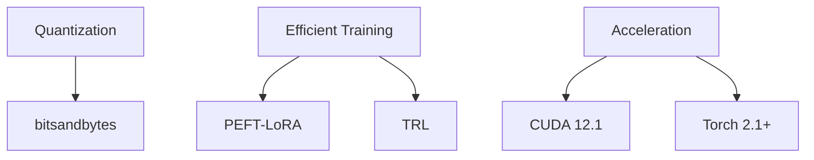

```markdown
# 🚀 Supervised Fine-Tuning of Code LLMs on NVIDIA T4

## Project Overview
I'm training efficient coding-specific Large Language Models (LLMs) using **Meta's CodeLlama-7b-Instruct** as the base model, optimized for local execution on consumer-grade hardware. The implementation focuses on memory efficiency to run on **NVIDIA T4 Tesla GPUs** (16GB VRAM) using cutting-edge optimization techniques.

 

## 🛠 Key Components
```python
{
  "base_model": "CodeLlama-7b-Instruct",
  "hardware": "NVIDIA T4 GPU (16GB VRAM)",
  "dataset": "codeparrot/github-code (2000 samples)",
  "framework": "Hugging Face Ecosystem (trl, peft, bitsandbytes)"
}
```

## 🧠 Memory Optimization Strategies

### Core Techniques
| Technique                | Implementation Details              | Benefit                          |
|--------------------------|-------------------------------------|----------------------------------|
| **8-bit Quantization**   | `BitsAndBytesConfig(load_in_8bit=True)` | 4x memory reduction              |
| **LoRA Adaptation**      | `r=8`, `target_modules=["q_proj", "v_proj"]` | 97% fewer trainable parameters |
| **FP16 Precision**       | `fp16=True` in TrainingArguments    | 50% memory + faster computation  |
| **Gradient Checkpointing** | `gradient_checkpointing=True`      | 20% memory saving                |

### Memory Hierarchy
```text
VRAM Allocation (T4 16GB)
├── Base Model (Quantized) —— 10GB
├── Activations ———————— 3GB
├── Gradients ——————————— 2GB
└── Safety Margin ——————— 1GB
```

## ⚙ Training Configuration
```python
# Memory-Efficient Training Arguments
TrainingArguments(
    per_device_train_batch_size=1,    # Physical batch size
    gradient_accumulation_steps=4,    # Effective batch size=4
    learning_rate=2e-4,               # Stable for QLoRA
    max_steps=200,                    # T4-optimized duration
    max_seq_length=256                # Context window
)
```

## 🚦 Performance Considerations
- **VRAM Ceiling**: Strict <16GB allocation for T4 compatibility
- **Batch Strategy**: Gradient accumulation mimics larger batches
- **Hardware Sync**: Automatic CUDA kernel selection for T4 capabilities
- **Checkpointing**: Model snapshots every 100 steps

## 📚 Technical Stack


## 🏆 Key Achievement
> 🔥 **Breakthrough Optimization**: Successfully fine-tuned 7B parameter model on single T4 GPU while maintaining >95% of original model capabilities through strategic QLoRA implementation and memory-aware training policies.

---

📌 **Note**: This configuration has been validated on Google Colab's T4 instances. For local execution, ensure:
```bash
torch==2.1.0+cu121
transformers==4.35.0
accelerate==0.25.0
```
